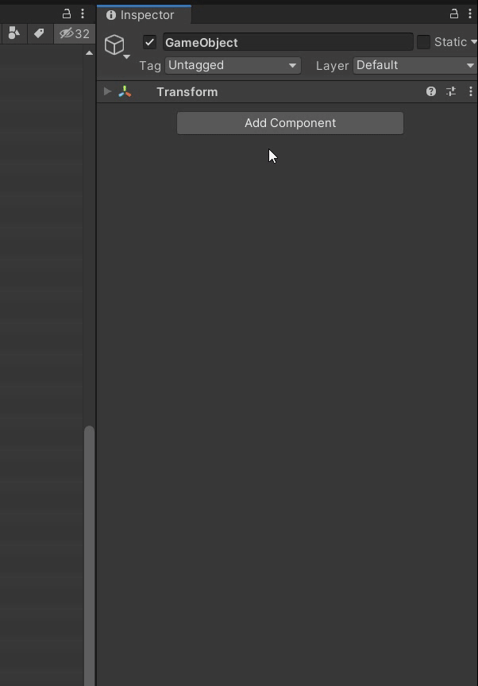

<div align="center">    

</div>

**UTween** 是一个 **Unity** 环境下的插值动画组件，可以通过内置组件快速配置动画，或者通过代码编写动画。


[](https://openupm.com/packages/com.ls9512.utween/)
[](https://github.com/ls9512/UTween/releases)


[](https://996.icu)

[](https://github.com/ls9512/UTween/issues)
[](https://github.com/ls9512/UTween/pulls)
[](https://github.com/ls9512/UTween)

[[English Documents Available]](README.md)

<!-- vscode-markdown-toc -->
* 1. [快速开始](#)
	* 1.1. [特性](#-1)
	* 1.2. [环境要求](#-1)
	* 1.3. [功能预览](#-1)
	* 1.4. [插件安装](#-1)
* 2. [ 参数定义](#-1)
* 3. [内置功能](#-1)
	* 3.1. [核心组件](#-1)
		* 3.1.1. [Tweener](#Tweener)
		* 3.1.2. [TweenManager](#TweenManager)
		* 3.1.3. [TweenPool](#TweenPool)
		* 3.1.4. [TweenAnimation](#TweenAnimation)
		* 3.1.5. [TweenAnimationAsset](#TweenAnimationAsset)
	* 3.2. [数据类型](#-1)
	* 3.3. [缓动函数](#-1)
		* 3.3.1. [标准缓动函数](#-1)
		* 3.3.2. [附加缓动函数](#-1)
	* 3.4. [插值动画](#-1)
* 4. [执行流程](#-1)
* 5. [性能测试](#-1)
* 6. [使用示例](#-1)
	* 6.1. [常规调用](#-1)
	* 6.2. [链式编程](#-1)
	* 6.3. [快速调用接口](#-1)
	* 6.4. [原生组件扩展方法](#-1)
	* 6.5. [顺序/并行](#-1)
	* 6.6. [动态起止点](#-1)
	* 6.7. [动画组](#-1)
	* 6.8. [动画配置](#-1)
* 7. [用户扩展](#-1)
	* 7.1. [添加自定义缓动函数](#-1)
	* 7.2. [添加自定义插值动画](#-1)
* 8. [后续计划](#-1)

<!-- vscode-markdown-toc-config
	numbering=true
	autoSave=true
	/vscode-markdown-toc-config -->
<!-- /vscode-markdown-toc -->

##  1. <a name=''></a>快速开始
###  1.1. <a name='-1'></a>特性
* 提供详细的参数以实现高自由度的自定义动画。
* 内置大量常用组件的位移、旋转、缩放、数值、颜色等动画实现。
* 内置大量常用缓动函数，并提供独立设置不同轴的自定义曲线。
* 提供编辑器组件、配置文件以及代码调用三种使用模式。
* 所有动画均可以导出保存为配置文件，以实现动画资源管理和重用。
* 支持动态起始点，动画过程中动态调整参数（仅脚本模式可用）。
* 提供基于 `MaterialPropertyBlock` 的高性能材质动画。
* 除操作字符串相关的动画外，基本做到 0 GC。
* 良好的链式编程支持。

###  1.2. <a name='-1'></a>环境要求
 
 

###  1.3. <a name='-1'></a>功能预览
添加组件，并使用丰富的内置动画和缓动函数：
<div align="center">    

</div>

内置缓动函数：
<div align="center">    

</div>

支持每个轴向独立曲线：
<div align="center">    

</div>

编辑器实时预览动画，所见即所得：
<div align="center">    

</div>

内置曲线路径编辑器：
<div align="center">    

</div>

###  1.4. <a name='-1'></a>插件安装
* 1.通过最新的 [release](https://github.com/ls9512/UTween/releases) 版本的 unitypackage 安装。
* 2.通过 [OpenUPM](https://github.com/openupm/openupm) 安装：
```
openupm add com.ls9512.utween
```
* 3.通过 [Unity Package Manager - Git URL](https://docs.unity3d.com/Manual/upm-ui-giturl.html)安装：
```
"com.ls9512.utween": "git+https://github.com/ls9512/utween"
```
* 4.下载仓库源码手动安装。
* 5.未来可能发布到 AssetStore。

##  2. <a name='-1'></a> 参数定义
* **From**: 插值的起始值
* **To**: 插值的结束值
* **Curve**: 自定义插值动画曲线，会累乘于缓动函数的计算结果之上
* **Curve Target**: 可选择曲线的运算结果作用在插值因子上还是插值结果数值上
* **Curve Mode**: 可以选择单根曲线作用于整体或者每个轴使用单独的曲线控制
* **Play Type**: 播放类型，可选 **Once, Loop, LoopCount, PingPong, PingPongCount**
* **Ease Type**: 内置缓动函数类型，默认为线性，可选效果较多，请自行测试。
* **Loop Count**: 循环次数
* **Duration:**: 插值过程持续时间，单位 s
* **Interval**: 重复播放间隔时间，仅 Loop 和 PingPong 模式可用
* **Speed Based**: 基于速度而非时间插值，选中后 Duration 参数作为速度值使用

* **Start Delay**: 插值开始的延迟时间，单位 s
* **Auto Play**: 自动播放的时机，默认 None 不自动播放，可选 **Awake, Start, Enable**， 如果选择 Enable， 会被多次触发
* **Update Type**: 计算更新的时机，根据动画实际需要调整，默认为 **Update**, 可选 **LateUpdate** 和 **FixedUpdate**
* **Time Scale**: 时间缩放，决定动画是否收到时间缩放变速的影响，可以控制插值动画与游戏过程分离
* **Self Scale**: 自身时间缩放，用于调整动画播放速度，会改变动画的实际运行时长
* **Time Smooth**: 是否使用 **Time.smoothDeltaTime**，可以让动画不因为帧率波动而抖动，仅在 **Time Scale** 为 **true** 时可用
* **Auto Kill**: 播放完后是否自动销毁(仅非无限循环类型播放有效)
* **Callback**: 用于注册插值开始和结束时的回调

***

##  3. <a name='-1'></a>内置功能
###  3.1. <a name='-1'></a>核心组件
####  3.1.1. <a name='Tweener'></a>Tweener
实现单一动画效果的最小化组件，对应一组完整的动画参数，每个 Tweener 组件独立运行。

####  3.1.2. <a name='TweenManager'></a>TweenManager
用于管理调度所有的 Tweener 组件，维护所有的 TweenPool，受 **Unity MonoBehaviour** 生命周期控制，提供 **Update / LateUpdate / FixedUpdate** 的更新模式。

####  3.1.3. <a name='TweenPool'></a>TweenPool
组件内部对象池，用于 Tweener 组件的回收再利用。

####  3.1.4. <a name='TweenAnimation'></a>TweenAnimation
Tweener 的编辑器类，用于在 **Inspector** 中配置动画，针对不同的 Tweener 提供不同的配置界面。但 TweenAnimation 本身不提供任何逻辑功能，动画的运行任然依赖于 TweenManager，组件只提供数据和配置接口。

####  3.1.5. <a name='TweenAnimationAsset'></a>TweenAnimationAsset
基于 `ScriptableObject` 实现的动画配置资源文件，可以从 `TweenAnimation` 导入导出，可以通过代码调用以创建动画。

###  3.2. <a name='-1'></a>数据类型
* float
* Vector2
* Vector3
* Vector4
* Quaternion
* Color
* Rect
* Transform(Position Vector3/Rotation Vector3/Scale Vector3)

###  3.3. <a name='-1'></a>缓动函数
####  3.3.1. <a name='-1'></a>标准缓动函数
* Linear
* Circular
* Quad
* Cubic
* Cubic
* Quart
* Sine
* Expo
* Circ
* Back
* Bounce
* Elastic

####  3.3.2. <a name='-1'></a>附加缓动函数
* Flash
* Step
* Parabola
* Trigonometric

###  3.4. <a name='-1'></a>插值动画
* Position
* Poition UGUI
* Rotation EulerAngles
* Rotation Quaternion
* Scale
* Transform
* Size
* Width
* Height
* Color
* ColorBlock
* Alpha
* CanvasGroup Alpha
* AudioSource Volume
* Scrollbar
* Slider
* Text
* Shkae
* Value
* Material Color
* Material Float
* Material Tilling
* Material OFfset
* Material Vector4
* Gradient
* Path
* Sequence
* Parallel

##  4. <a name='-1'></a>执行流程
* 准备所有必要参数.
* 通过 RunTime / Duration 计算出插值因子。
* 将实际插值因子代入到对应 `EasyType` 的 `EaseFunction` 中计算。
* 当 CurveMode == Factor 时，将差值因子乘上曲线计算结果。
* 用最终得到的插值因子计算出插值结果数值。
* 当 CurveMode == Value 时，将插值结果乘上曲线计算结果。
* 将插值结果作用到目标组件，刷新组件状态.

***

##  5. <a name='-1'></a>性能测试
* 测试平台 : i5-8500 / 16GB DDR4 2666 / GTX 950 / Unity 2019.4.3f1
* 1000 个 GameObject 在场景中依赖 TweenAnimation/TweenPosition 组件执行，在编辑器模式下，Profier 统计每帧消耗CPU时间 3.21ms，同样环境和动画效果下 DOTween 为 2.51ms。
* 除了启动时对象池为空，需要创建所有需要的 Tweener 对象，以及字符串相关操作，大部分情况下 GC 为 0.

***

##  6. <a name='-1'></a>使用示例

###  6.1. <a name='-1'></a>常规调用
```csharp
var tween = UTween.Create<TweenValue>();
tween.SetFrom(0f);
tween.SetTo(1f);
tween.SetDuration(2f);
tween.SetFloatCallback(value =>
{
    Debug.Log("Value : " + value); }
});
tween.Play();
```
###  6.2. <a name='-1'></a>链式编程
可以通过 `Tween.Create<>()` 接口快速创建插值动画，并以`链式编程`的方式设置部分属性和回调。
```csharp
UTween.Create<TweenValue>()
	.SetFrom(0f)
	.SetTo(1f)
	.SetDuration(5f)
	.SetUpdateType(UpdateType.Update)
	.SetPlayType(PlayType.Once)
	.SetEaseType(EaseType.Linear)
	.SetTimeScale(false)
	.SetPlayCallback(() => { Debug.Log("Play"); })
	.SetValueCallback(value => { Debug.Log("Value : " + value); })
	.SetStopCallback(() => { Debug.Log("Stp["); })
	.Play();
```

###  6.3. <a name='-1'></a>快速调用接口
```csharp
UTween.Position(transform, Vector3.zero, Vector3.one, 1f);
UTween.Scale(transform, Vector3.zero, Vector3.one, 1f);
UTween.Rotation(transform, new Vector3(0, 0, 0), new Vector3(0, 360, 0), 1f);
UTween.Color(image, Color.black, Color.white, 1f);
UTween.Alpha(image, 0f, 1f, 1f);
// 更多API请自行尝试
```

###  6.4. <a name='-1'></a>原生组件扩展方法
```csharp
Transform transform;
transform.Move(Vector3.zero, Vector3.one, 1f);
```
目前仅包含少量原生组件扩展接口，后续会添加。

###  6.5. <a name='-1'></a>顺序/并行
顺序插值动画 / 并行插值动画，可以一次性控制一组 Tweener 的状态，但此时子 Tweener 的回调和状态变化都不会触发，转交由上层组件控制。
* Sequence Example :
``` cs
 UTween.GetSequence()
	.Append(UTween.Position(SequneceMoveObj, Vector3.zero, Vector3.one, 2f))
	.Append(UTween.Position(SequneceMoveObj, Vector3.one, Vector3.up, 2f))
	.Append(UTween.Position(SequneceMoveObj, Vector3.up, Vector3.left, 2f))
	.Append(UTween.Position(SequneceMoveObj, Vector3.left, Vector3.zero, 2f))
	.Play();
```

* Parallel Example : 
``` cs
UTween.GetParallel()
	.Append(UTween.Position(ParallelMoveObj1, new Vector3(2, 0, 0), new Vector3(4, 0, 0), 2f))
	.Append(UTween.Position(ParallelMoveObj2, new Vector3(2, 2, 0), new Vector3(4, 2, 0), 2f))
	.Play();
```

###  6.6. <a name='-1'></a>动态起止点
使用 `SetFromGetter / SetToGetter` 方法设置动态获取起点和终点的方法，并确保动画更新在起始点数值更新之后进行，就可以得到一个起点终点动态改变的插值动画：
```csharp
public float FromValue = 0f;
public float ToValue = 0f;

UTween.Value(0f, 5f, 1f, value => FromValue = value);
UTween.Value(10f, 5f, 1f, value => ToValue = value);

UTween.Create<TweenValue>()
	.SetFromGetter(()=> FromValue)
	.SetToGetter(()=> ToValue)
	.SetDuration(1f)
	.SetUpdateType(UpdateType.LateUpdate)
	.Play();
```
###  6.7. <a name='-1'></a>动画组
通过 `Identifier` 参数获取一个物体上配置的一个或多个动画组件所生成的动画实例并播放：
```csharp
var tweeners = gameObject.GetTweeners("Open");
tweeners.Play();
```
实时获取动画组件或者动画实例开销较高，建议预先缓存 `TweenAnimation` 组件的引用并在需要时调用。

###  6.8. <a name='-1'></a>动画配置
通过加载的动画配文件创建动画，指定作用对象后播放：
```csharp
TweenAnimationAsset Asset;

UTween.Create(Asset)
 	.SetTarget(TweenPosTarget)
	.Play();
```
##  7. <a name='-1'></a>用户扩展
###  7.1. <a name='-1'></a>添加自定义缓动函数
1.创建自定义缓动类型常量：
```csharp
[EnumClass("EaseType")]
public static class EaseTypeExtension
{
#if UNITY_EDITOR
	[UnityEditor.InitializeOnLoadMethod]
#else
	[UnityEngine.RuntimeInitializeOnLoadMethod]
#endif
	public static void Init()
	{
		SerializeEnumAttribute.CacheSerializeEnum(typeof(EaseTypeExtension));
	}

	[EnumProperty("Extension", "Ease Lerp")]
	public const int EaseLerp = 10001;
}
```

2.创建自定义插值类并集成实现 `EaseFunction` 类型：
```csharp
public class EaseLerp : EaseFunction
{
	public override int Type => EaseTypeExtension.EaseLerp;

	public override float Ease(float from, float to, float delta)
	{
		return Mathf.Lerp(from, to, delta);
	}
}
```

###  7.2. <a name='-1'></a>添加自定义插值动画
1.创建自定义动画类型常量：
```csharp
[EnumClass("TweenType")]
public static class TweenTypeExtension
{
#if UNITY_EDITOR
	[UnityEditor.InitializeOnLoadMethod]
#else
	[UnityEngine.RuntimeInitializeOnLoadMethod]
#endif
	public static void Init()
	{
		SerializeEnumAttribute.CacheSerializeEnum(typeof(TweenTypeExtension));
	}

	[EnumProperty("UI", "Text FontSize")]
	public const int TextFontSize = 10001;
}
```

2.创建自定义插值类并集成实现 `Tweener<TValue, TComponent>` 类型：
```csharp
[Tweener(TweenTypeExtension.TextFontSize)]
[RequireComponent(typeof(Text))]
public class TweenTextFontSize : TweenFloatBase<Text>
{
	public override int Type => TweenTypeExtension.TextFontSize;

	protected override void SetValue(float value)
	{
		Component.fontSize = (int)value;
#if UNITY_EDITOR
		// 确保编辑器预览刷新
		if (!Application.isPlaying)
		{
			UnityEditor.EditorUtility.SetDirty(Component);
		}
#endif
	}
}
```

3.如有需要在编辑器下使用，则还需要编写对应的编辑器代码：
```csharp
[TweenerEditor(TweenTypeExtension.TextFontSize)]
public class TweenTextEditor : TweenFloatBaseEditor
{
	public override int Type => TweenTypeExtension.TextFontSize;
	public override int RequireCurveCount => 1;
	public override bool AllowQuickOperation => true;
	public new TweenTextFontSize Tweener => Target as TweenTextFontSize;
}
```

***

##  8. <a name='-1'></a>后续计划
该项目为自研自用插件，已经经过一定时间和多个中小型项目的积累验证，现决定开源供大家学习和使用，但并不意味着这是一个完成度很高的商业化插件，可能存在诸多功能缺失和隐性BUG，如无意外，该项目后续将不会再更新新功能，作者将着手开发一个全新的动画插件，将与当前版本并不兼容，新项目将在保持现有特性的前提下进行大规模重构，并着重于提高易用性、扩展性和性能。尽管如此，如果你在使用 `UTween` 的过程中遇到任何问题或者发现BUG，都可以在这个仓库的 `Issues` 中进行提交反馈，也欢迎想要共同改进完善插件的人发起 `Pull Request`。